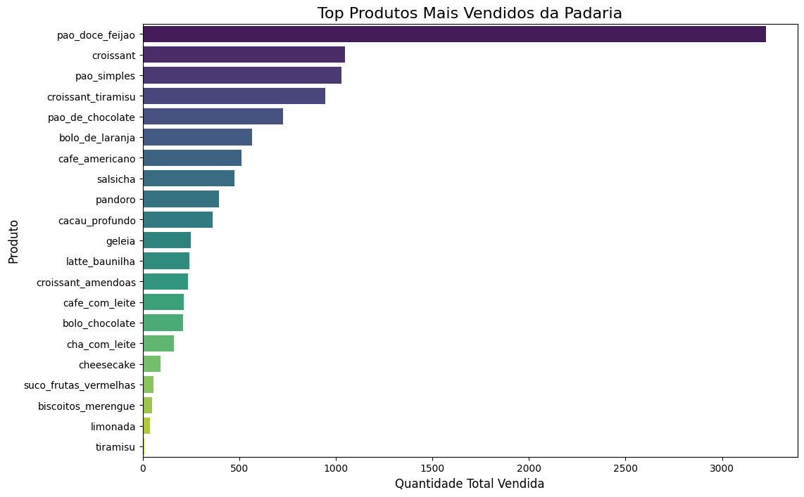
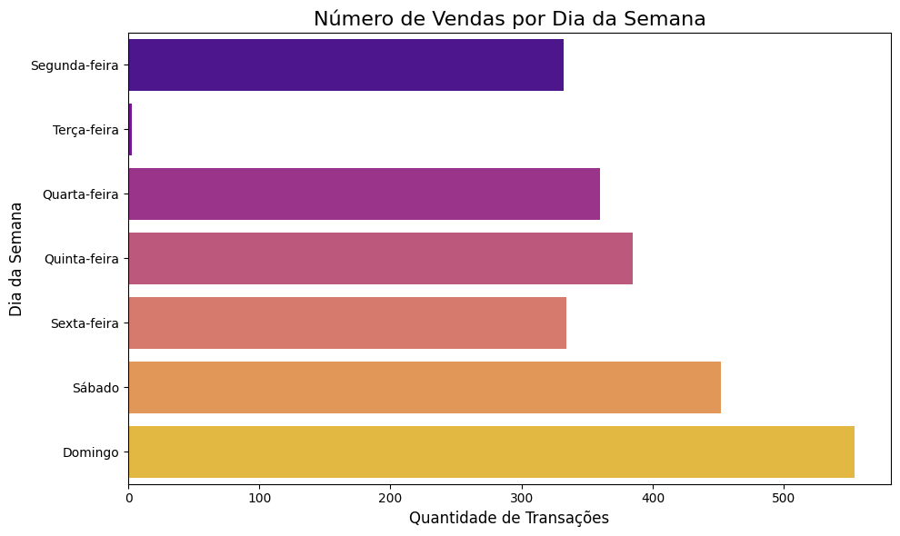
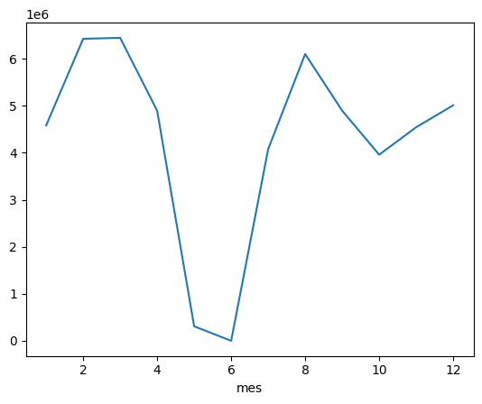
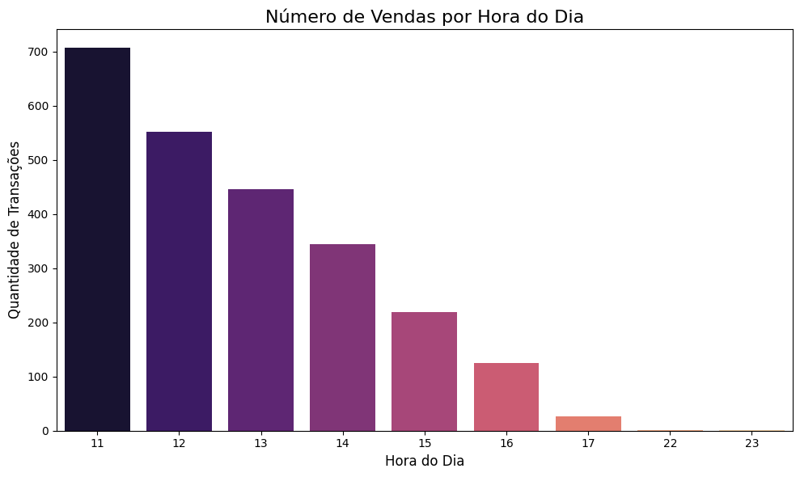

[Read in Portuguese](README.pt.md) 

---

# 🥐 The Bakery's Secrets: An Analysis with a Taste of UX

Every bakery tells a story through its aromas and flavors. But what if we could uncover its deepest secrets by analyzing its sales data? What do the numbers tell us about the neighborhood's favorite bread, the rhythm of the week, or the busiest hours?

This project dives into **a full year of transactions (10,840 sales)** to transform raw data into a visual narrative. With an approach inspired by **UX/UI design**, the goal isn't just to show charts, but to tell the bakery's story in a clear, intuitive, and flavorful way.

---

## 🥖 Fresh Ingredients: The Data

Our recipe begins with a high-quality dataset, representing the bakery's operations for an entire year.

* **Period Analyzed:** From July 11, 2019, to June 18, 2020.
* **Volume:** 10,840 validated transactions after cleaning.

---

## 💡 Secrets Revealed: Insights Straight from the Oven

After "baking" the data with Python, Pandas, and Matplotlib, we uncovered three secrets about the heart of the business.

### Secret #1: The King of the Counter
There is an undisputed champion on the shelves. **Sweet Red Bean Bread** is not just the bestseller; it's a true star, overwhelmingly outperforming all other products. Croissants and plain bread form the royal court, while items like tiramisu and lemonade seem to be mere extras.

### Secret #2: The Rhythm of the Week
The bakery dances to the beat of the week. **Weekends (Saturday and Sunday) are the peak of the party**, with the highest sales volume. In contrast, **Tuesday is an almost completely silent day**, raising the suspicion that the bakery might be closed.

### Secret #3: The Lunchtime Rush
The clock doesn't lie. The period between **11 AM and 2 PM is the golden hour**, concentrating the peak traffic, likely driven by the lunch rush. After 3 PM, the pace slows down dramatically, indicating a shift in consumer behavior.

---

## 🍰 The Chef's Slice: Strategic Recommendations

Based on these secrets, here are a few recommendations to slice up success:

* **Capitalize on the King:** Create combos, promotions, or even variations of the Sweet Red Bean Bread to leverage its popularity even further.
* **Optimize for the Peaks:** Boost stock and staff for weekends and the lunchtime rush to ensure no customer leaves empty-handed.
* **Warm-Up the Slow Days:** Develop special promotions and offers for Mondays and Wednesdays to attract customers on slower days.
* **Review the Menu:** Analyze the products with very low sales. They could be reformulated, better marketed, or even removed to optimize production.

---

## 🛠️ The Analysis Kitchen: Files & Technologies

* **Logbook:** `bakery_sales_analysis.ipynb` (the notebook with the full analysis).
* **Recipe Book (Dataset):** [Bakery Sales - Kaggle](https://www.kaggle.com/datasets/hosubjeong/bakery-sales).
* **Photographs (Visualizations):** `/imgs/`.

**Technologies Used:**
* Python (Pandas, Matplotlib, Seaborn)
* Jupyter Notebook
* UX/UI Design principles for visual clarity.

---

## 👨‍💻 O Arquiteto da Análise

* **Yan Enrique**
* **LinkedIn:** [https://www.linkedin.com/in/yanenrique/](https://www.linkedin.com/in/yanenrique/)
* **GitHub:** [https://github.com/OYanEnrique](https://github.com/OYanEnrique)
* **Landing page:** [https://yanenrique.carrd.co](https://yanenrique.carrd.co)
---
