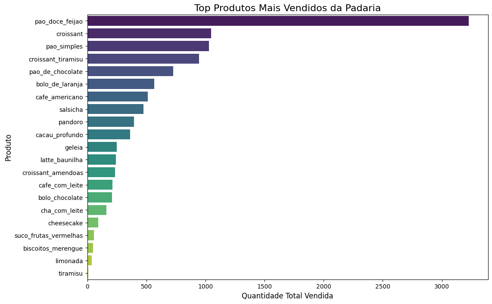

[Leia em inglês](README.md)

---

# 📊 Análise de Vendas de uma Padaria

Este projeto apresenta uma análise de um ano inteiro de vendas de uma padaria, com base em 10.840 transações limpas e estruturadas. O objetivo principal foi transformar dados brutos em insights visuais claros, utilizando princípios de design UX/UI para melhorar a experiência do usuário e a legibilidade.

## 📅 Período dos Dados
- Início: **11/07/2019 15:35**
- Fim: **18/06/2020 14:52**
- Total de vendas após limpeza: **10.840 transações**

## 🔍 Principais Insights

### 🥖 Produtos Mais Vendidos
- **Pão doce de feijão** é o produto mais vendido, disparado.
- **Croissant, pão simples e croissant tiramisù** também têm bom desempenho.
- Produtos com vendas muito baixas (ex: tiramisù, limonada) podem precisar de reavaliação.

### 📆 Vendas por Dia da Semana
- **Fins de semana (sábado e domingo)** são os dias com maior volume de vendas.
- **Terça-feira** apresenta vendas extremamente baixas, possivelmente indicando que a loja está fechada nesse dia.
- Os dias úteis mostram vendas moderadas com leve crescimento até quinta-feira.

### ⏰ Vendas por Hora do Dia
- O pico de vendas ocorre entre **11h e 14h**, horário do almoço.
- Queda acentuada nas vendas após as 15h.

## 💡 Recomendações
- **Aproveitar a popularidade do pão doce de feijão** com promoções e variações.
- **Otimizar o estoque** com base nos dias e horários de pico.
- **Criar ações promocionais às terças-feiras** para aumentar o fluxo.
- **Reavaliar produtos com baixo desempenho** para cortar perdas ou melhorar o marketing.

## 📁 Arquivos
- `bakery_sales_analysis.ipynb`: notebook com a análise completa
- `dataset`: [Bakery Sales - Kaggle](https://www.kaggle.com/datasets/hosubjeong/bakery-sales)
- `imgs/`: visualizações dos dados

## ✨ Tecnologias Utilizadas
- Python (Pandas, Matplotlib, Seaborn)
- Jupyter Notebook
- Design visual minimalista inspirado em UX/UI

---
Desenvolvido com 💚 por Yan Enrique
